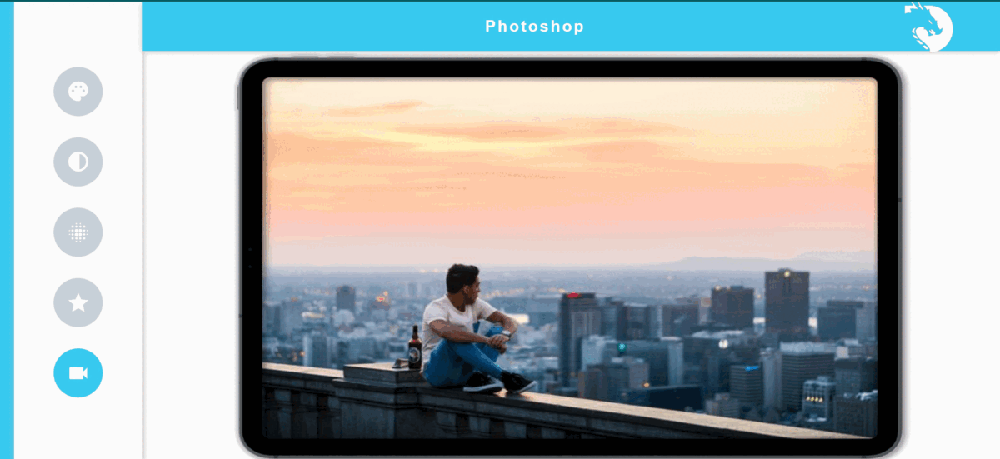

# CV Web Application

Welcome to the CV Web Application! This web-based tool allows you to perform various image processing operations on your images using OpenCV.

## Features

- Convert an image to grayscale
- Apply a blur effect to an image
- Detect edges using the Canny edge detector
- Reset an image to its original state

## Dependencies

The following dependencies are required for the CV Web Application:

1. OpenCV (provided via opencv.js)
2. Material Icons (provided via Google Fonts)
3. Roboto Font (provided via Google Fonts)

## How to Use

1. Open the application in your web browser.

2. Upload an image by clicking the "Choose File" button.

3. Use the icons on the sidebar to apply different image processing operations:

        RGB: Display the original image (color).
        Grayscale: Convert the image to grayscale.
        Blur: Apply a blur effect to the image.
        Edge: Detect edges using the Canny edge detector.

4. The main canvas will display the processed image. You can click on the icons to apply different operations multiple times.

## Project Demo

Note: The GIF above provides a brief demonstration of the CV Web Application in action.

## About

This project was developed as a simple web-based tool for image processing using OpenCV. It is suitable for educational purposes and provides a user-friendly interface for applying basic image transformations.

Feel free to contribute to this project by submitting pull requests or suggesting improvements.

